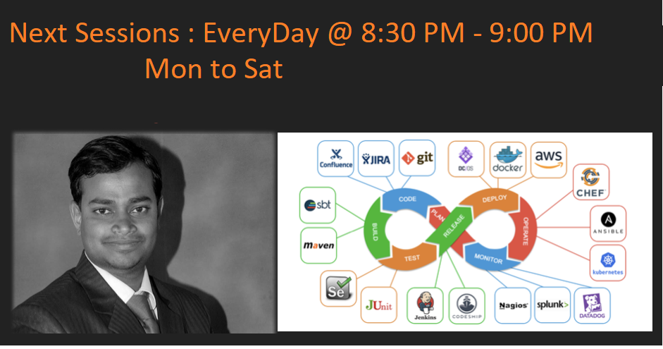

(https://youtu.be/6HXhoO_2jRs)

[Link](https://youtu.be/6HXhoO_2jRs)
# Welcome to Dev-ops-dose

Here is a 30 days challenge, to learn something new. 

#DEVOPS

I provide you the day wise training session for 30 days. 
Every day you need to spend 30 mins with me on Live session. 

# Objectives.

## - To Learn, understand and appreciate DEVOPS 
## - To develop a workable devops pipeline.
## - Spend atleast 30 mins a Day for next 30 days. 

For support and discussion  [Join our Whatapp group](https://chat.whatsapp.com/EYtBtyICAYwCVAngWKqUgi).

#  Day 1 Video Recorded link

[Video](https://youtu.be/d-7S7n8pcUQ)

[presentation](https://github.com/sachinvastrad/dev-ops-dose/blob/master/k8day1.pdf)

[MiNI-KUBE on Windows Cheatsheet](https://github.com/sachinvastrad/dev-ops-dose/blob/master/MiniKubeOnWindows.md)

[MiNI-KUBE on Mac/Linux  Cheatsheet ](https://github.com/sachinvastrad/dev-ops-dose/blob/master/MiniKubeOnMac.md)

#  Day 2 Video and Recorded link

[Video](https://youtu.be/_hrITUq_aMA).

[Presentation](https://github.com/sachinvastrad/dev-ops-dose/blob/master/K8DAY2.pdf)

[MiniKube PlayGround](https://kubernetes.io/docs/tutorials/kubernetes-basics/create-cluster/cluster-interactive/)

[KubeCtl cheetsheet](https://kubernetes.io/docs/reference/kubectl/cheatsheet/)
-----------------------------------------
## Quiz Time : take a Quiz here  [Quiz click here](https://sachinvastrad.github.io/quiz-time/)
## Note its all client side quiz , nothing is sent to the server , so your performace is with you only  not disclosed to anyone , unless you do. 
-----------------------------------------
# Day 3 Video and Recording link
[video](https://youtu.be/rxTpc5-j4_w)

# Day 4 Video and Recording Link 
[video](https://youtu.be/6HXhoO_2jRs)

# Day 5 Video and Recording Link 
[video](https://youtu.be/wpcRIvXPaLM)

# Day 6 Video and Recording Link 
[video](https://youtu.be/rzeR4bwij4M)

### Support or Contact

